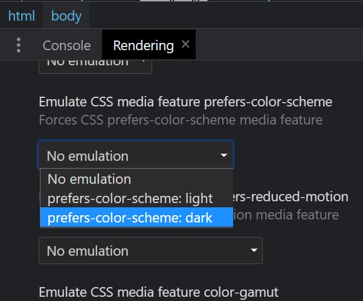

<h1 align="center"> Calculadora </h1>
<h3 align="center">
  Uma calculadora simples e intuitiva com suporte a comandos de voz e temas personalizados.
</h3>

<p align="center">
  
  
  
    
  
  
</p>

<div align="center">
  
</div>

## Sobre

<p align="justify">
Este projeto foi criado como parte de um desafio, com o objetivo de desenvolver uma calculadora funcional e responsiva. Durante o processo, o escopo foi ampliado para incluir melhorias na arquitetura, acessibilidade e personalização, transformando o desafio em uma aplicação moderna e repleta de funcionalidades usando apenas html, css e javascript evitando ao máximo libs externas.
</p>

<div align="center">
  
  <br>
  <span>
    Desafio inicial feito por
    <a href="https://www.frontendmentor.io/challenges/calculator-app-9lteq5N29">
    <em>Frontend Mentor</em>
    </a>
  </span>
</div>

## Tabela de Conteúdos

- [Funcionalidades](#funcionalidades)
- [Web Speech API](#web-speech-api)
- [Prefer color scheme](#prefer-color-scheme)
- [Projetos relacionados](#sugestoes)
- [Stars](#stars)

## Funcionalidades

- Realizar operações matemáticas básicas (adição, subtração, multiplicação, divisão)
- Suporte a comandos de voz para facilitar a interação
- Temas personalizados para a interface (utilizando prefer-color-scheme)
- Responsividade para diferentes tamanhos de tela
- Integração com comandos via teclado
- Shortcuts dinâmicos para troca de temas
- Guia automático ensinando a utilizar a calculadora

## Web Speech API

> Para desenvolver o recurso de suporte a comando de voz, sem adicionar bibliotecas externas ao projeto, foi utilizado o recurso <a href="https://developer.mozilla.org/en-US/docs/Web/API/Web_Speech_API/Using_the_Web_Speech_API" target="_blank"><code>Web Speech API</code></a>

Essa funcionalidade permite utilizar o recurso de áudio do próprio navegador e receber um ou mais resultados do que foi falado, em uma string.

No projeto, dentro da pasta JS temos o arquivo chamado `Speak.js` com a implementação necessária para a utilização dos comandos de voz, nele primeiro iremos começar a utilizar a web speech api na função `setup`:

```js
if (!('webkitSpeechRecognition' in window)) {
  this.#startBtn.disabled = true
  console.error('Speech recognition not available')
  return
}

this.#recognition = new webkitSpeechRecognition()
this.#recognition.continuous = true
this.#recognition.lang = 'pt-BR'
this.#recognition.interimResults = true

this.addListeners() // Adiciona o toggle de escutar ou não o usuário
```

Após a configuração, podemos começar a processar a fala e tomar algumas ações com o que foi dito, na função `start`: 

```js
this.#recognition.onresult = (event) => {
  const results = Object.values(event.results)

  if (results.length) this.#startBtn.classList.add('listening')

  for (const result of results) {
    const { transcript } = result[0]
    const { isFinal } = result

    if (isFinal) this.#calculator.executeVoiceCommand(transcript.trim(), this.getVoiceActions())
  }
}

this.#recognition.start()
```

Nesse caso, estamos iniciado o reconhecimento de fala e processando cada resultado (palavra ou frase dita) esperando até o momento da frase final ser completa, exemplo de resultados para uma frase "2+2":

1. "dois" ou "2"
2. "mais" ou "+"
3. "dois" ou "2"
4. ao terminar de falar a frase, entender que o resultado final deve ser "2+2"

No caso, é importante executar o comando de voz apenas com a frase final para ter a garantia do contexto como um todo foi processado e estamos obtendo o resultado mais próximo do desejado

Podemos também, lidar com o caso de erro:

```js
this.#recognition.onend = () => {
  this.updateListeningState(false)
}
```

> A função updateListeningState, tem como objetivo alterar o estilo do botão de escuta.

Por fim, iremos precisar configurar uma função para parar de ouvir o usuário e manipular alguns estilos:

```js
this.#recognition.stop()
this.updateListeningState(false)
this.#startBtn.classList.remove('listening')
```

## Prefer Color Scheme

> Para auxiliar os 3 diferentes temas da calculadora, foi usado o recurso de mídia <a href="https://developer.mozilla.org/en-US/docs/Web/CSS/@media/prefers-color-scheme" target="_blank"><code>prefer-color-scheme</code></a>.

Esse recurso possibilita o entendimento de qual a preferência do usuário em relação aos temas, assim podendo receber dois valores:

- Light (Claro)
- Dark (Escuro)

A maneira de aplicar esse recurso, no css, de acordo com a developer.mozilla é da seguinte maneira:

```css
@media (prefers-color-scheme: dark) {
  /* Configurações CSS para o tema dark */
}

@media (prefers-color-scheme: light) {
  /* Configurações CSS para o tema light */ 
}
```

Mas com esse método o código irá ficar mais verboso e provavelmente com difícil manutenção, pois seria necessário repetir todas as propriedades desejadas com suas novas colorações.

### Então qual a solução ? 🤔

Iremos apenas mudar os valores das variáveis do CSS com JS.

Primeiro iremos, na pasta de constantes, verificar o arquivo `themes.js`:

```js
export const themes = {
  'Default': {
    id: '1',
    colors: [ { name: '--background', value: '#3a4764' } ]
  },
  'Light': {
    id: '2',
    colors: [ { name: '--background', value: '#e6e6e6' } ]
  },
  'Dark': {
    id: '3',
    colors: [ { name: '--background', value: '#17062a' } ]
  }
}
```
Note o _Nome dos temas_ e os _id's_ utilizados, eles serão utilizados no arquivo `ThemeManager.js`, na pasta JS, da seguinte forma:

```js
function changeThemeById(themeId) {
  const theme = Object.values(this.themesConfig).find(theme => theme.id === themeId)
  if (!theme) return

  this.#btnTheme.value = theme.id
  this.applyTheme(theme.colors)
}

function setPreferColorSchemeTheme() {
  if (!this.#btnTheme || !window.matchMedia) return

  Object.keys(this.themesConfig).forEach(themeName => {
    const matchedPreferredScheme = window.matchMedia(`(prefers-color-scheme: ${themeName})`)?.matches

    if (matchedPreferredScheme) this.#btnTheme.value = this.themesConfig[themeName].id
  })

  this.changeThemeById(this.#btnTheme.value)
}
```

O objetivo aqui, está em fazer um código para troca de temas de forma versátil e de fácil manutenção.
Nesse caso, conseguimos buscar a preferência do usuário, através do `window.matchMedia('(prefers-color-scheme: ${themeName})')`, concatenado com o nome do nosso tema (que é igual a nomenclatura desejada)

Após descobrir o tema desejado, podemos enviar o id do tema em questão para função `changeThemeById` com objetivo de obter a nova coloração desejada

> Para entender exatamente o que cada função está fazendo, como a `applyTheme`, acesse o arquivo na pasta JS

### Como é Possível fazer o Teste/Debug ? 🤔

Com a ferramenta de devtools do seu navegador, acesse a aba "Rendering" e logo após procure o título "Emulate CSS media feature prefers-colors-scheme":



Alterando os valores padrões pelo devtools, o resultado final será:


<h2 id="sugestoes">Você também pode gostar</h2>

- [Gitfest](https://github.com/Igorcbraz/GitFest) - Gere uma lineup de festival com base nos seus principais repositórios do Github
- [Enkoji](https://github.com/Igorcbraz/Enkoji) - Site feito para o Enkoji, um templo zen-budista japonês fundado em 1920 no Japão

<h2 id="stars">⭐ Stars ⭐</h2>

[](https://github.com/Igorcbraz/Calculadora/stargazers)
