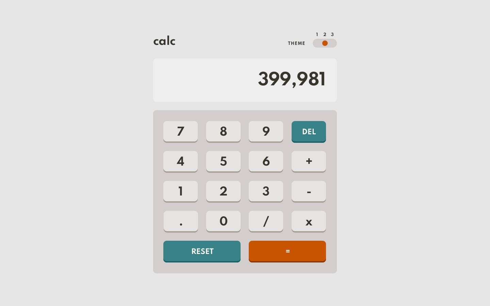
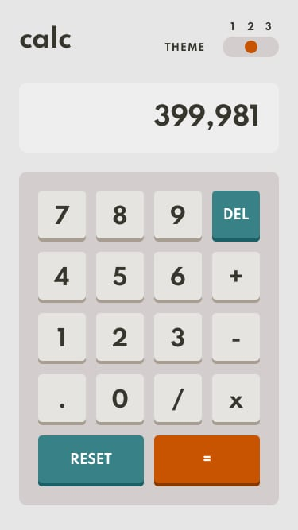
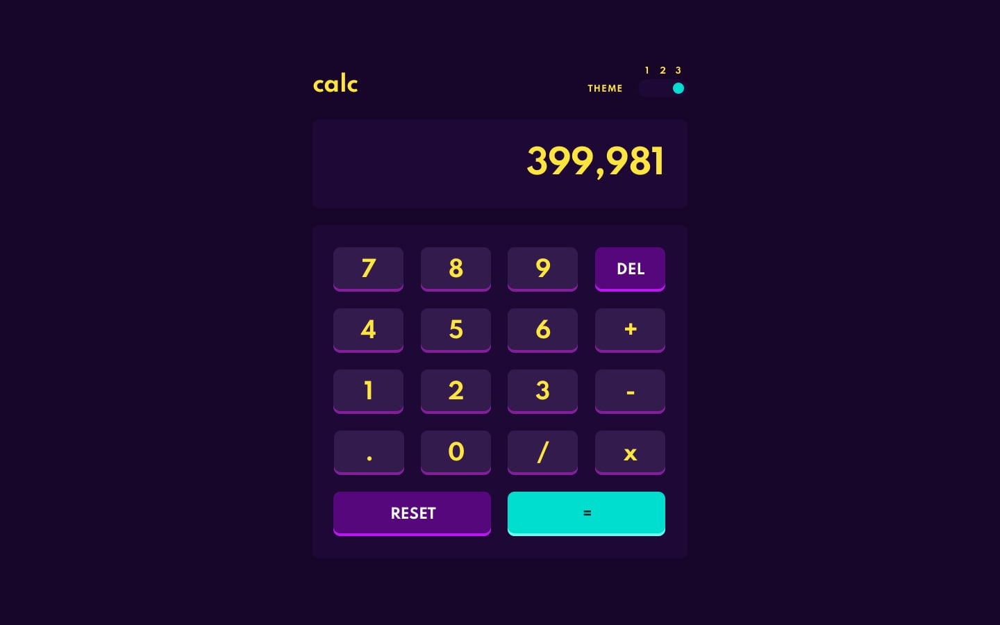
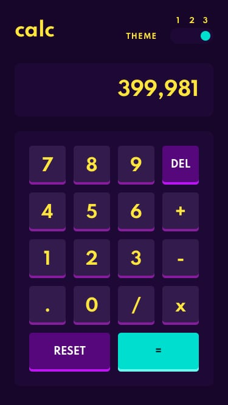

<!-- Começo/ Apresentação -->
<h1 align="center">📚 Calculadora 📊</h1>
<h3 align="center"> ⚡ <a href="https://igorcbraz.github.io/Calculadora/" target="_blank">Calculadora</a> Responsiva e com opções para troca de temas ⚡</h3>

<!-- Imagens do Projeto -->
<div align="center">
 
<br><br>

<!-- Atribuições-->
Desafio feito por <a href="https://www.frontendmentor.io/challenges/calculator-app-9lteq5N29"><em>Frontend Mentor</em></a>
</div>

<hr></hr>    
    
<h3 align="left">🌗  Prefer Color Scheme:</h3>
<p>Além dos 3 diferentes temas da calculadora, foi usado o recurso de mídia <a href="https://developer.mozilla.org/en-US/docs/Web/CSS/@media/prefers-color-scheme" target="_blank"><code>prefer-color-scheme</code></a>.</p>

<p>Esse recurso possibilita o entendimento de qual a preferência do usuário em relação aos temas, assim podendo receber dois valores:</p>

<ul>
<li>Light (Claro)</li>
<li>Dark (Escuro)</li>
</ul>

<p>A maneira de aplicar esse recurso de acordo com a developer.mozilla é da seguinte maneira:</p>

```
@media (prefers-color-scheme: dark) {
  // Configurações CSS para o tema dark
}

@media (prefers-color-scheme: light) {
  // Configurações CSS para o tema light
}
```
<p>Mas com esse método o carregamento do código irá ficar mais lento pois seria necessário repetir todas as propriedades desejadas com suas novas colorações.</p>
<h4>Então qual a solução ? 🤔</h4>
<p>Iremos apenas mudar os valores das variavéis do CSS com JS.</p>

```
const darkThemeMq  = window.matchMedia("(prefers-color-scheme: dark)");
const lightThemeMq = window.matchMedia("(prefers-color-scheme: light)");
```
<p>Primeiro identificamos qual a preferência de tema do usúario e guardamos o resultado em uma constante.</p>
<p>Agora só precisamos verificar qual o valor das constantes e modificar os valores das variáveis do CSS</p>

```
if (darkThemeMq.matches) {
    document.getElementById('btnTheme').value = "3";
    theme.dark();
} else if(lightThemeMq.matches){
    document.getElementById('btnTheme').value = "2";
    theme.light();    
} else {
    document.getElementById('btnTheme').value = "1";
    theme.defaul();    
}
```
<p>theme.dark(),theme.light()... Armazenam os comandos para modificar os valores das variáveis no CSS. Sendo eles:</p>

```
const theme = {
    defaul(){
        root.style.setProperty('--background'          , '#3a4764');
        // E as demais variavéis
    },
    light(){
        root.style.setProperty('--background'          , '#e6e6e6');
        // E as demais variavéis
    },
    dark(){
        root.style.setProperty('--background'          , '#17062a');
        // E as demais variavéis
    }
}

// Get the root element
var root = document.querySelector(':root');
```

<h4>Como é Possível fazer o Teste/Debug ? 🤔</h4>
</p>Podemos usar a ferramenta de desenvoledor do google chrome e alterar os valores Dark ou Light</p>


<h4>Resultado Final:</h4>


<div align="left">

  <br>

  <br>
    
</div>
    
<!-- Tecnologias e Frameworks Usados-->
<h3 align="left">🧠  Tecnologias e Frameworks Usados:</h3>

   
