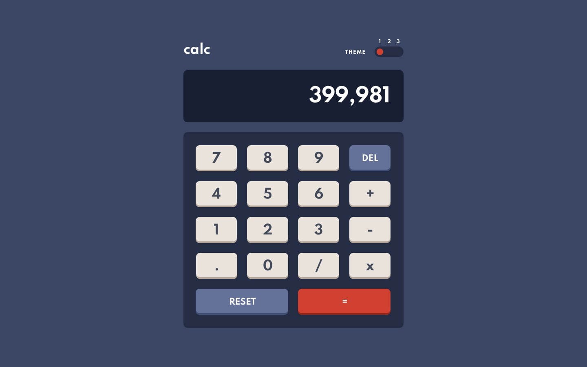
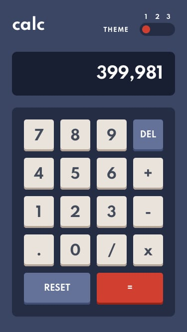

<!-- Começo/ Apresentação -->
<h1 align="center">📚 Calculadora 📊</h1>
<h3 align="center"> ⚡ <a href="https://igorcbraz.github.io/Calculadora/">Calculadora</a> Responsiva e com opções para troca de temas ⚡</h3>

<!-- Imagens do Projeto -->

 
  
<!-- Atribuições-->
Desafio feito por <a href="https://www.frontendmentor.io/challenges/calculator-app-9lteq5N29"><em>Frontend Mentor</em></a>

    
    
<!-- Tecnologias e Frameworks Usados-->
<h3 align="left">🧠  Tecnologias e Frameworks Usados:</h3>

   

